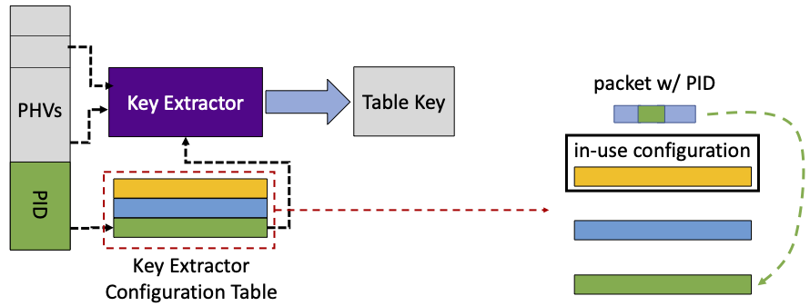
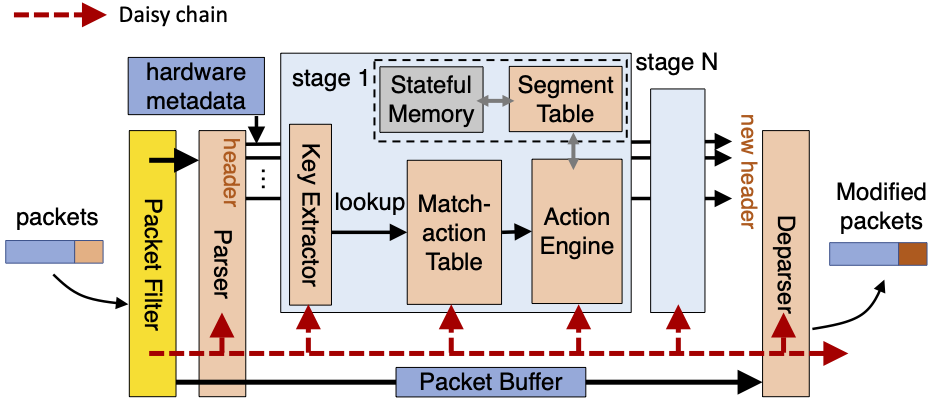

## The Need for Isolation Mechanisms for Programmable Pipelines
Today, data-plane programmability in the form of pipeline-based programmable networking devices (e.g., Intel Mount Evans DPU, Fungible DPU, Intel Tofino, etc.) is the mainstream. As more and more applications are utilizing those devices to improve their performances and are deployed on shared cloud infrastructure, there is a natural question: how to provide isolation to enable **multiple** programs sharing **one** such programmable device? 

**Menshen** is our attempt to this question.

## Menshen

Please check our [paper](https://www.usenix.org/conference/nsdi22/presentation/wang-tao) for the details. Basically, there are two main challenges:

1. how to enable program switching at gigabit or terabit rate.
2. how to support disruption-free reconfiguration.

### Program Switching at Per-packet Timescale using overlays

Menshen assumes each packet carry its program ID (PID). In the parsing, the parser will append this PID to the packet header vectors (PHVs), which is then pushed to flow through the ingress/egress pipelines.

Take key extractor as an example. PID is used to index a configuration table, where the configurations of different programs are stored in the registers, and get the corresponding configuration. This configuration is then used to select fields from PHVs for constructing table key, which is then matched agianst the entries in match action tables.

The configurations of different programs are overlaid with each other. The overlays technique is just like the overlays in memory management of early day's computer system, where the whole configurations are not be able to fit in and only the partial ones can.

Indexing or reading the associated configuration for each packet only needs 2 cycles in our current implementation. This will not impact the pipeline's throughput due to the pipelining technique.

### Disruption-free Reconfiguration

Menshen leverages daisy chain to enable disruption-free reconfiguration. The basic idea is to have another reconfiguration path for the reconfiguraiton signals.

## Publication
**Isolation Mechanisms for High-Speed Packet-Processing Pipelines** [[Paper and Talk](https://www.usenix.org/conference/nsdi22/presentation/wang-tao)]  
Tao Wang, Xiangrui Yang, [Gianni Antichi](https://gianniantichi.github.io/), [Anirudh Sivaraman](https://cs.nyu.edu/~anirudh/), and [Aurojit Panda](https://cs.nyu.edu/~apanda/)

## Artifact
Please check the detailed instructions at [Menshen's hardware library](https://github.com/multitenancy-project/menshen) and [Menshen's software](https://github.com/multitenancy-project/menshen-compiler).

## Contact
If you have any questions in the meantime please send us an e-mail at
[tao.wang@nyu.edu](mailto:tao.wang@nyu.edu).
